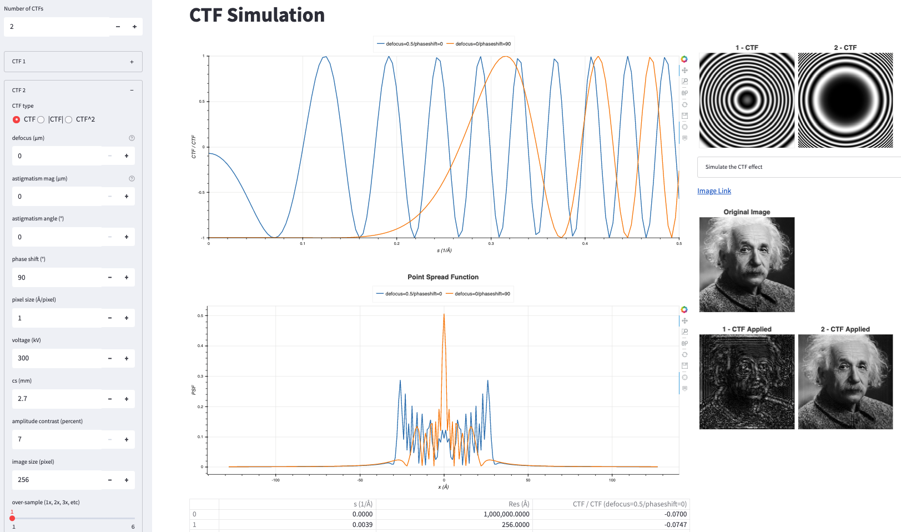

# ctfsimu-streamlit
This Web app uses [Streamlit](https://www.streamlit.io) to provide online simulation of the [contrast transfer function (CTF)](https://en.wikipedia.org/wiki/Contrast_transfer_function) of transmission electron microscopes.

