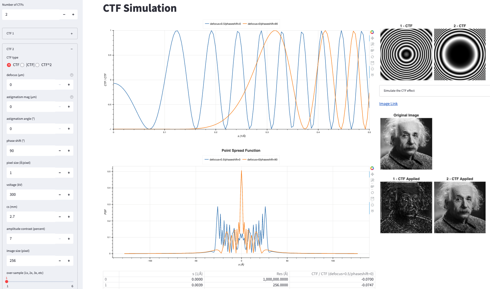

# CTF Simulation
This Web app provides an interactive online simulation of the [contrast transfer function (CTF)](https://en.wikipedia.org/wiki/Contrast_transfer_function) of transmission electron microscopes.

Click one of the links ([Site 1](https://jianglab.github.io/ctfsimulation) | [Site 2](https://ctfsimulation.streamlit.app) | [Site 3](https://app.py.cafe/app/wjiang/ctfsimulation-solara)) to explore the CTF function!

<a href="https://jianglab.github.io/ctfsimulation/?showPSF=1&show2D=1&simulateImage=1&shareUrl=1&imageMode=tvTest&ctf0_dfdiff=0.1&ctf0_dfang=45"></a>

---
You can also embed the Web app into your own Website using an [iframe](https://www.w3schools.com/tags/tag_iframe.asp), for [example](https://iframetest.com/?url=https://jianglab.github.io/ctfsimulation) using the following code
```html
<iframe src="https://jianglab.github.io/ctfsimulation?lite=1"></iframe>
```
